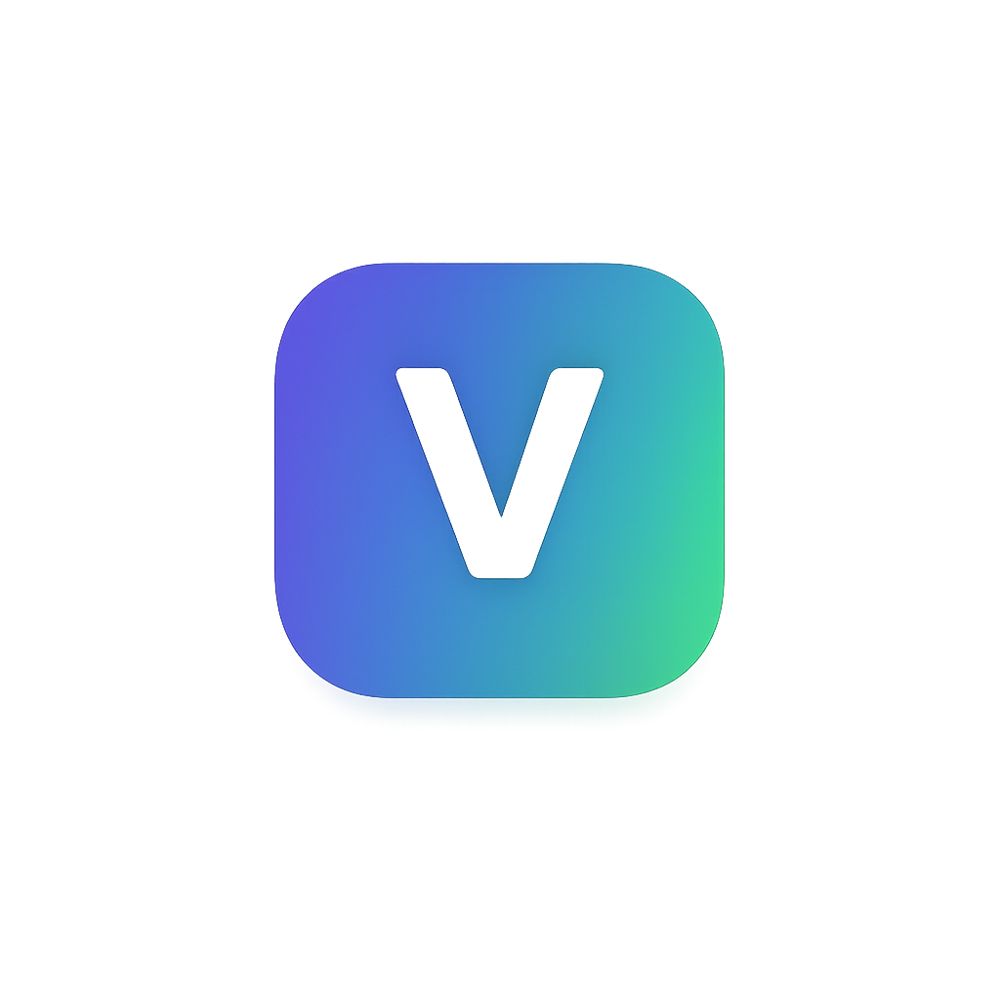
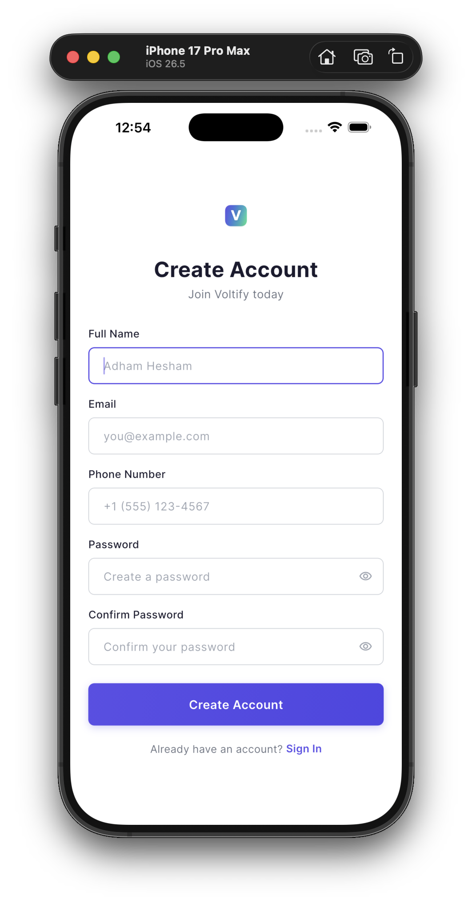
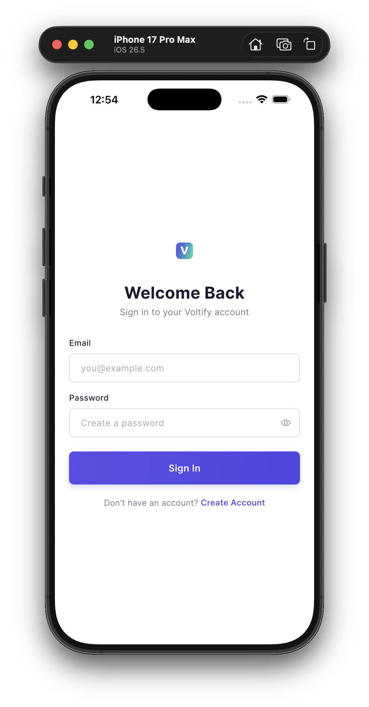

# Voltify ⚡

> **Smart Energy Management Mobile Application**  
> Built with Flutter · Mock-only backend · Clean Architecture

<p align="center">
  
</p>

---

## Overview

Voltify is a cross-platform mobile application for smart energy management. It gives users a clear view of their energy consumption, estimated bills, solar generation, and CO₂ savings — all in a clean, modern interface built with Flutter.

The app currently runs on a **mock backend** — no external services or API keys are required to build or run it.

---

## Screenshots

<p align="center">
  
  &nbsp;&nbsp;&nbsp;
  
</p>

| Screen | Description |
|--------|-------------|
| **Sign Up** | Create a new account with full name, email, phone, and password |
| **Sign In** | Sign in with email and password |
| **Home Dashboard** | Energy overview, monthly summary cards, and recent activity feed |

---

## Features

- **Authentication flow** — Sign Up, Sign In, Sign Out with form validation
- **Mock backend** — zero external dependencies; all auth calls return instant mock responses
- **Energy Dashboard** — daily usage, monthly bill estimate, solar generation, CO₂ savings
- **Recent Activity** — list of energy-consuming devices with timestamps and usage
- **Form Validation** — full name, email, phone, password strength, and confirm-password rules
- **Loading & error states** — spinner during async operations, snackbar feedback on success/failure
- **Clean Architecture** — domain / data / presentation layers with BLoC state management

---

## Project Structure

```
lib/
├── main.dart                          # Entry point
├── app.dart                           # MaterialApp + root widget
├── injection_container.dart           # GetIt dependency injection setup
│
├── core/
│   ├── constants/
│   │   ├── app_colors.dart            # Color tokens
│   │   ├── app_dimensions.dart        # Spacing & sizing tokens
│   │   ├── app_strings.dart           # All user-facing strings
│   │   └── app_text_styles.dart       # Typography scale
│   ├── errors/
│   │   └── failures.dart              # Domain failure classes
│   ├── theme/
│   │   └── app_theme.dart             # Material 3 light theme
│   └── utils/
│       └── validators.dart            # Form validation rules
│
└── features/
    ├── auth/
    │   ├── data/
    │   │   ├── datasources/
    │   │   │   └── auth_datasource.dart        # Mock auth data source
    │   │   └── repositories/
    │   │       └── auth_repository_impl.dart   # Repository implementation
    │   ├── domain/
    │   │   ├── entities/
    │   │   │   └── user_entity.dart            # User domain model
    │   │   ├── repositories/
    │   │   │   └── auth_repository.dart        # Repository contract
    │   │   └── usecases/
    │   │       ├── sign_up_usecase.dart
    │   │       └── sign_in_usecase.dart
    │   └── presentation/
    │       ├── cubit/
    │       │   ├── sign_up_cubit.dart / sign_up_state.dart
    │       │   └── sign_in_cubit.dart / sign_in_state.dart
    │       ├── screens/
    │       │   ├── sign_up_screen.dart
    │       │   └── sign_in_screen.dart
    │       └── widgets/
    │           ├── custom_text_field.dart
    │           ├── primary_button.dart
    │           └── sign_up_header.dart
    └── home/
        └── presentation/
            └── screens/
                └── home_screen.dart            # Energy dashboard
```

---

## Assets

```
assets/
├── images/
│   ├── voltify_logo.png               # App logo (used in all screens)
│   └── screenshots/
│       ├── sign_up_screen.png         # Sign Up screen screenshot
│       └── sign_in_screen.png         # Sign In screen screenshot
└── icons/
    └── voltify_logo.svg               # Original SVG source for the logo
```

> Typography is served via the `google_fonts` package (Inter font family) — no local font files needed.

---

## Dependencies

| Package | Version | Purpose |
|---------|---------|---------|
| `flutter_bloc` | ^9.1.0 | State management (Cubit) |
| `equatable` | ^2.0.7 | Value equality for states & entities |
| `get_it` | ^8.0.3 | Dependency injection / service locator |
| `dartz` | ^0.10.1 | Functional `Either<Failure, Success>` types |
| `google_fonts` | ^6.2.1 | Inter font family |

**Dev dependencies:** `flutter_lints`, `bloc_test`, `mockito`, `mocktail`

---

## Supported Platforms

| Platform | Minimum Version | Status |
|----------|----------------|--------|
| iOS | 16.0 | ✅ Supported |
| Android | API 21 (Android 5.0) | ✅ Supported |

---

## Installation

### Prerequisites

- Flutter SDK `>=3.2.0`
- Dart SDK `>=3.2.0`
- Xcode 15+ (for iOS)
- Android Studio / Android SDK (for Android)

### Clone & install

```bash
git clone https://github.com/menna3lwan/Voltify.git
cd Voltify
flutter pub get
```

---

## Running the Project

### iOS Simulator

```bash
# List available simulators
flutter devices

# Run on a specific simulator
flutter run -d <device-id>

# Example
flutter run -d "iPhone 17 Pro Max"
```

### Android Emulator / Device

```bash
flutter run -d <device-id>
```

### All platforms check

```bash
flutter doctor
flutter analyze        # Must show: No issues found
```

---

## Build Instructions

### Android Release APK

```bash
flutter build apk --release
# Output: build/app/outputs/flutter-apk/app-release.apk
```

### iOS Release Archive + IPA

```bash
# Build unsigned IPA (for internal distribution / simulator)
flutter build ipa --no-codesign
# Archive: build/ios/archive/Runner.xcarchive

# For App Store / TestFlight — open in Xcode Organizer and sign with your Apple Developer account
open build/ios/archive/Runner.xcarchive
```

---

## User Flow

```
App Launch
    │
    ▼
Sign Up Screen ──── "Sign In" link ────► Sign In Screen
    │                                         │
    │ (success)                               │ (success)
    ▼                                         ▼
                  Home Dashboard
                       │
                       │ Sign Out
                       ▼
                  Sign Up Screen
```

---

## Architecture

The app follows **Clean Architecture** with three layers:

```
Presentation  →  Domain  →  Data
   (BLoC)       (UseCases)  (MockDataSource)
```

- **Presentation** — Flutter widgets + Cubit state management
- **Domain** — Pure Dart: entities, repository contracts, use cases
- **Data** — Mock implementations; swap in a real backend by replacing `MockAuthDataSource`

---

## License

This project is private. All rights reserved © Voltify.
